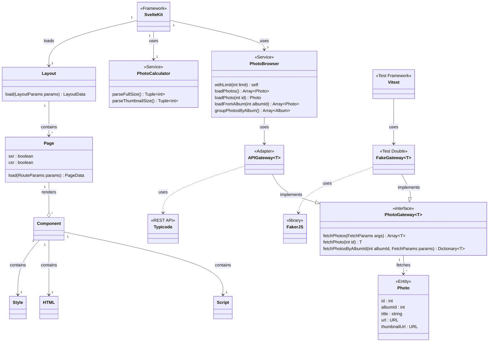

# 🌅 SvelteKit Photo Browser 🌉

A website for browsing photos and albums delivered via Typicode API.

The real purpose of this project is to demonstrate building a modern frontend application architecture with **SvelteKit** and **Hexagonal / Clean Architecture** principles.

<!-- TODO: Add blog post series link here -->

## Demo

See the demo application on [**Netlify**](https://sveltekit-photo-browser.netlify.app/).

## Instructions

1. Install [Taskfile](https://taskfile.dev/installation).
2. Install project dependencies with `task install`
3. Run application development mode with `task dev`
4. Make changes
5. Run tests with `task test`

## Architecture

Overview of the software architecture and design is visualised in a Mermaid diagram below.

### Components

Modules used to build this application:

- [**Svelte**](https://svelte.dev/)
- [**SvelteKit**](https://kit.svelte.dev/)
- **Zod** schema parser
- **Axios**
- **TypeScript**
- **Dracula UI**

### Structure

The structure follows the Hexagonal / Clean Architecture principles regarding:

- **application layer** using
  - SvelteKit routes to retrieve data for view models
  - Svelte components to render UIs
- **service layer** handling the use cases for
  - grouping all photos by album
  - retrieving a photos belonging to a specific album
  - retrieving a single photo
  - calculating sizes for photos and thumbnails
- **domain layer** describing photo entities and relevant business logic
- **infrastructure layer** handling
  - external REST calls via an outbound adapter
  - error handling via an outbound adapter (only `console.error` for now)

### Tests

The architecture has been designed with testability as the first priority.

Unit tests are built with [**Vitest**](https://vitest.dev/) targeting the use cases and domain logic. Dependency to the external API is replaced with a test double returning stub responses. See `*.test.ts` files under `src/` directory for details.

Acceptance tests are built with [**Playwright**](https://playwright.dev/) targeting the application UI. See `*.spec.ts` files under `tests/`directory for details.

The full test suite runs in a matter of minutes both locally and in **GitHub Actions**, which is acceptable for a robust feedback loop.
